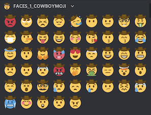

# Cowboymoji
They always say "yee haw" but they never ask "haw yee"... until now.

This is a simple library that provides Unicode [emoji](https://en.wikipedia.org/wiki/Emoji) support for `cowboy` and `pensive_cowboy` variants of popular emojis. It is built off of the [twemoji emoji set](https://github.com/twitter/twemoji).

This library supports 305 cowboy emojis and 37 pensive cowboy emojis.

- [Full set of cowboys](examples/cowboy_full_set.png)
- [Full set of pensive cowboys](examples/pensive_cowboy_full_set.png)

## Structure

All emojis are distributed using the source emoji code as the filename. To convert to your own naming conventions, use the [Unicode Emoji List](https://unicode.org/emoji/charts/full-emoji-list.html).

- `assets/cowboy/png` contains 200x200px `.png`s of cowboys.
- `assets/cowboy/svg` contains `.svg`s of cowboys.
- `assets/pensive_cowboy/png` contains 200x200px `.png`s of pensive cowboys.
- `assets/pensive_cowboy/svg` contains `.svg`s of pensive cowboys.
- `scripts` contains scripts to generate new cowboymojis and pensive cowboymojis programmatically.

## Discord Emojis

If you have a Discord Nitro account and want to use some of the emojis right away, feel free to join any of the relevant discords:

- [faces_1_cowboymoji](https://discord.gg/VaF49gaQ4v): 1/2 of the standard emoji face set.
- [faces_2_cowboymoji](https://discord.gg/dpEm6aBNjJ): the remaining standard emoji face set and cat faces.
- [extra_cowboys_cowboymoji](https://discord.gg/rwdt84je8G): a random sampling of miscellaneous cowboys.
- [pensive_cowboys_cowboymoji](https://discord.gg/uakUM7XzTd): the entire set of `pensive_cowboy` emojis.

## License

Copyright 2021

Code licensed under the MIT License: <http://opensource.org/licenses/MIT>

Graphics licensed under CC-BY 4.0: <https://creativecommons.org/licenses/by/4.0/>
